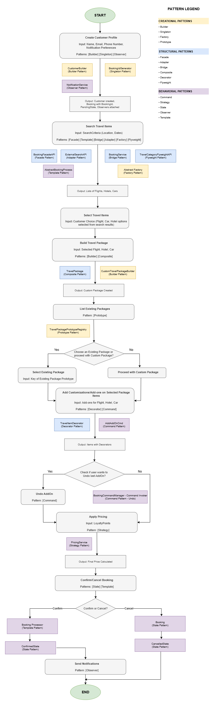

# TravelEase - Travel Booking System

## Table of Contents

- [Project Overview](#project-overview)
- [Architecture](#architecture)
- [Design Patterns Implemented](#design-patterns-implemented)
- [Project Structure](#project-structure)
- [Setup Instructions](#setup-instructions)
- [License](#license)

---

## Project Overview

**TravelEase** is a unified travel booking platform designed to streamline the process of coordinating flights, hotels, and car rentals into a single, seamless journey.

### The Problem
Travelers face a fragmented experience juggling multiple disconnected platforms, while businesses encounter rigid legacy systems that are difficult to customize or extend.

### Key Features
- Build personalized travel packages
- Access dynamic pricing strategies
- Manage the entire itinerary in one place
- Receive notifications across multiple channels

### Goal
Eliminate fragmentation and booking friction by creating a modular, scalable solution that adapts to evolving requirements using **Gang of Four (GoF) Design Patterns**.

---

## Architecture

### System Workflow



### Technology Stack

- **Language**: Java 11
- **Build Tool**: Maven
- **IDE**: Eclipse / IntelliJ IDEA / VS Code
- **Version Control**: Git & GitHub

---

## Design Patterns Implemented

The project demonstrates **15 Gang of Four (GoF) Design Patterns**:

### Creational Patterns

| Pattern | Purpose | Implementation |
|---------|---------|----------------|
| **Singleton** | Ensures single instances of critical components | `BookingIdGenerator`, `FlyweightSingletonFactory` |
| **Abstract Factory** | Creates families of related products | `BudgetTravelFactory`, `LuxuryTravelFactory`, `BusinessTravelFactory` |
| **Builder** | Constructs complex objects step-by-step | `CustomTravelPackageBuilder`, `CustomerBuilder` |
| **Prototype** | Clones predefined travel packages | `TravelPackagePrototypeRegistry` |

### Structural Patterns

| Pattern | Purpose | Implementation |
|---------|---------|----------------|
| **Adapter** | Adapts external APIs to common interface | `FlightAPIAdapter`, `HotelAPIAdapter`, `CarRentalAPIAdapter` |
| **Bridge** | Decouples abstraction from implementation | `BookingService` ↔ `BookingProvider` |
| **Composite** | Treats individual items and packages uniformly | `TravelPackage` containing `TravelItemAPI` components |
| **Decorator** | Adds features dynamically to travel items | `MealDecorator`, `InsuranceDecorator`, `BaggageDecorator` |
| **Facade** | Provides simplified interface to complex subsystem | `BookingFacadeAPI` / `BookingFacadeImpl` |
| **Flyweight** | Shares common data to reduce memory usage | `TravelCategoryFlyweight` for category metadata |

### Behavioral Patterns

| Pattern | Purpose | Implementation |
|---------|---------|----------------|
| **Command** | Encapsulates requests as objects with undo support | `AddFlightCmd`, `AddHotelCmd`, `RemoveItemCmd` |
| **Observer** | Notifies subscribers of booking state changes | `EmailNotificationObserver`, `SMSNotificationObserver`, `AppNotificationObserver` |
| **State** | Manages booking lifecycle transitions | `PendingState`, `ConfirmedState`, `CancelledState` |
| **Strategy** | Selects pricing algorithm at runtime | `BasePricingStrategy`, `LoyaltyPricingStrategy`, `SeasonalPricingStrategy` |
| **Template Method** | Defines skeleton of booking workflow | `BookingProcessor` with subclasses for Flight/Hotel/Car |

---

## SOLID Principles

The project adheres to all five SOLID principles to ensure a clean, maintainable, and extensible codebase.

| Principle | Description | Example in TravelEase |
|-----------|-------------|----------------------|
| **Single Responsibility (SRP)** | Every class has one reason to change | `BookingIdGenerator` handles only ID generation; `Customer` manages only customer data |
| **Open/Closed (OCP)** | Classes are open for extension but closed for modification | New pricing strategies (e.g. `LoyaltyPricingStrategy`) extend `PricingStrategy` without modifying existing code |
| **Liskov Substitution (LSP)** | Subtypes can replace their base types without altering correctness | All `BookingProvider` implementations are interchangeable through the `BookingService` bridge abstraction |
| **Interface Segregation (ISP)** | Clients are not forced to depend on interfaces they don't use | `TravelItemAPI` and `Schedulable` are kept separate so not all travel items are forced to implement scheduling |
| **Dependency Inversion (DIP)** | High-level modules depend on abstractions, not concretions | `BookingFacadeImpl` depends on `BookingProvider` interface, not concrete API implementations |

---

## OOD Principles

Beyond SOLID, the project applies core Object-Oriented Design principles throughout.

| Principle | Description | Example in TravelEase |
|-----------|-------------|----------------------|
| **Encapsulation** | Internal state is hidden and accessed only through well-defined interfaces | `Customer` fields are private, exposed via builder and getters |
| **Abstraction** | Complexity is hidden behind clean interfaces and abstract classes | `BookingFacadeAPI` abstracts the entire subsystem; `TravelItemAPI` abstracts all bookable components |
| **Inheritance** | Common behavior is shared through a class hierarchy | `Customer` extends `Person`, reusing shared personal data fields |
| **Polymorphism** | Objects of different types are treated uniformly through a common interface | All decorators (`MealDecorator`, `InsuranceDecorator`) are treated as `TravelItemAPI` at runtime |
| **Composition over Inheritance** | Behavior is built by composing objects rather than deep inheritance chains | `TravelPackage` composes multiple `TravelItemAPI` components via the Composite pattern |
| **Program to Interfaces** | Code depends on abstractions rather than concrete implementations | Adapters (`FlightAPIAdapter`, `HotelAPIAdapter`) all implement a common interface consumed by the facade |
| **DRY (Don't Repeat Yourself)** | Logic is defined once and reused | `BookingProcessor` template method defines the shared booking workflow skeleton reused across Flight, Hotel, and Car subclasses |

---

## Project Structure

```
TravelEase/
│
├── src/main/java/
│   ├── Driver.java                          # Main entry point
│   └── travelease/
│       ├── TravelItemAPI.java               # Core component interface
│       ├── Customer.java                    # Customer entity
│       ├── Person.java                      # Base person class
│       ├── Schedulable.java                 # Scheduling interface
│       │
│       ├── adapter/                         # Adapter Pattern
│       ├── bridge/                          # Bridge Pattern
│       ├── builder/                         # Builder Pattern
│       ├── command/                         # Command Pattern
│       ├── composite/                       # Composite Pattern
│       ├── decorator/                       # Decorator Pattern
│       ├── demo/                            # Demo implementations
│       ├── facade/                          # Facade Pattern
│       ├── factory/                         # Abstract Factory
│       ├── flyweight/                       # Flyweight Pattern
│       ├── helper/                          # Utility classes
│       ├── observer/                        # Observer Pattern
│       ├── prototype/                       # Prototype Pattern
│       ├── singleton/                       # Singleton Pattern
│       ├── state/                           # State Pattern
│       ├── strategy/                        # Strategy Pattern
│       └── template/                        # Template Method Pattern
│
├── resources/                               # Images and resources
├── pom.xml                                  # Maven configuration
├── README.md                                # This file
└── LICENSE                                  # Apache 2.0 License
```

---

## Setup Instructions

### Prerequisites

- **Java Development Kit (JDK)**: Version 11 or higher
- **Maven**: Version 3.6+ (or use IDE's embedded Maven)
- **IDE**: Eclipse, IntelliJ IDEA, or VS Code
- **Git**: For version control

### Installation Steps

1. **Clone the Repository**
   ```bash
   git clone <repository-url>
   cd final-project-milestone-1-group-6
   ```

2. **Import into IDE**

   **For Eclipse:**
   - File → Import → Existing Maven Project
   - Select the project directory
   - Click Finish

   **For IntelliJ IDEA:**
   - File → Open
   - Select the project directory
   - IntelliJ will auto-detect Maven configuration

   **For VS Code:**
   - Open the project folder
   - Install "Extension Pack for Java" if not already installed

3. **Build the Project**
   ```bash
   mvn clean install
   ```

4. **Verify Setup**
   - Ensure no compilation errors
   - Check that all dependencies are resolved

---
### Expected Output

The demo will showcase:
1. Customer creation using Builder pattern
2. Search functionality with Template/Bridge/Adapter
3. Package building with Factory and Composite
4. Add-ons using Decorator
5. Pricing strategies
6. Command undo/redo
7. State transitions
8. Observer notifications

---
## License

This project is licensed under the Apache License 2.0 - see the [LICENSE](LICENSE) file for details.

